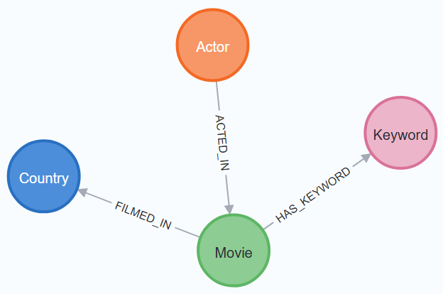

# About

## Data Models
Below are the data model diagram of each database.

### NoSQL Database (Neo4j)

<div align="center">
  
</div>

# Environment Variables

In order to run the code, you need to define the following environment files in a `.env` file.

| Key               | Value |
| ----------------- | ----- |
| WATCHMODE_API_KEY |       |
| NEO4J_PASSWORD    |       |
| POSTGRES_DB       |       |
| POSTGRES_USER     |       |
| POSTGRES_PASSWORD |       |

> A WATCHMODE_API_KEY can be generate [here](https://api.watchmode.com/).

# Starting the Docker Container

> **Note:** You will need [docker](https://docs.docker.com/engine/install/) install on your system in order to run the following commands.

A database for development purposes along with a pgadmin instace can be started with docker compose by using the following command:
```sh
docker compose up
```

Login credentials for both the postgres database and pgadmin instance can be found in the `docker-compose.yaml` file.

# Python Venv

First, install virtualvenv using `pip install virtualenv`.

Now, you can create a venv to work in using `virtualenv --python 3.12.1 venv`

> Note: You need the specified version on python installed on your local computer to run the command above

## Working in the venv

In order to activate the venv to start working in it, use this command:

```bash
# Linux and Mac
source venv/bin/activate

# Windows
.\venv\Scripts\activate
```

To stop working in the venv, use the command: `deactivate`.

## Installing Project Dependencies

Use the following command while in the venv to install the project's dependencies:

```bash
pip install -r requirements.txt
```
